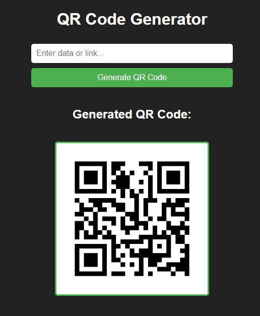

# QR Code Generator

This is a simple Flask application that generates QR codes based on user input. The generated QR code is displayed on the same page.



## Installation

1. Clone the repository or download the code files.
2. Install the required dependencies using the following command:

   ```
   pip install -r requirements.txt
   ```

## Usage

1. Run the Flask application by executing the following command:

   ```
   python app.py
   ```

2. Access the QR code generator by opening a web browser and navigating to `http://localhost:5000/`.

3. Enter the data or link that you want to encode into the QR code in the provided input field.

4. Click the "Generate QR Code" button to generate the QR code.

5. The generated QR code will be displayed below the form.


## Dependencies

- Flask==1.1.4
- qrcode==7.3

These dependencies are specified in the `requirements.txt` file. You can install them using the command mentioned in the installation section.

## License

This project is licensed under the [MIT License](LICENSE). Feel free to modify and use it according to your needs.